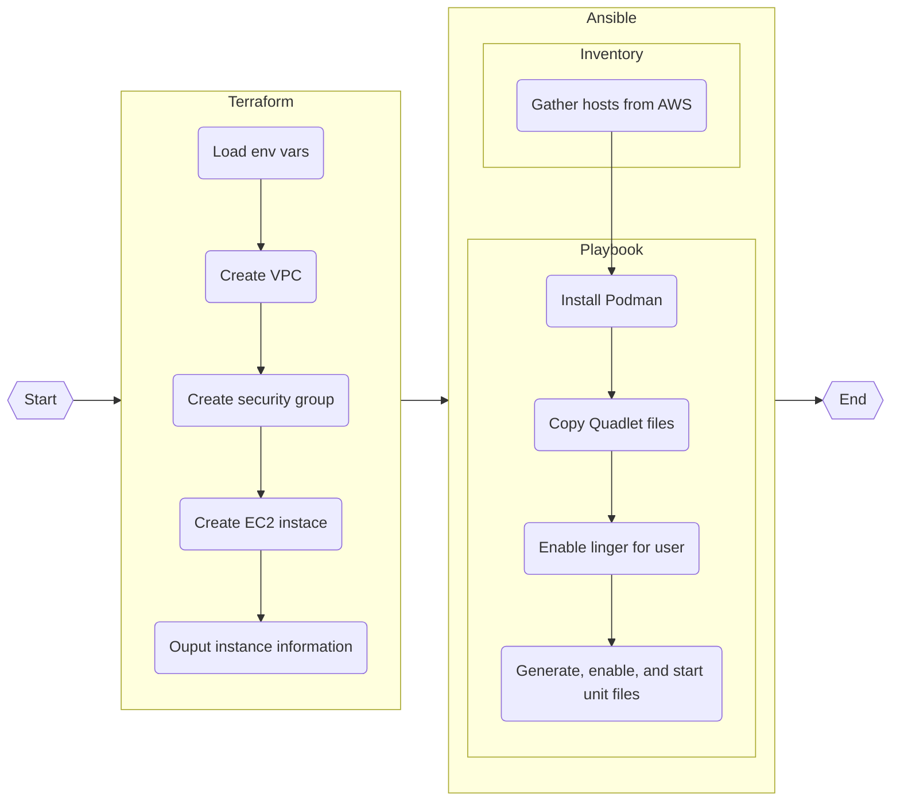

# EC2 Minecraft deployment

## Background

This repo contains automation to create an EC2 instance on AWS and deploy a Minecraft server on it using a Podman container.

The EC2 instance will be created using an [OpenTofu](https://opentofu.org/)/[Terraform](https://www.terraform.io/) configuration defined in [`main.tf`](./main.tf). This will connect to AWS and provision the required resources.

Minecraft will be deployed via the [Ansible](https://www.ansible.com/) playbook [`playbook.yaml`](./playbook.yaml). It will create a [Podman Quadlet](https://docs.podman.io/en/latest/markdown/podman-systemd.unit.5.html) with a Mincraft container image.

## Requirements

- An AWS account
    - Adequite IAM rules to perform tasks such as creating EC2 instances and VPCs
- The [AWS CLI v2](https://docs.aws.amazon.com/cli/latest/userguide/getting-started-install.html)
- AWS credentials stored as evironemnt variables as outlined in [`.envrc`](./.envrc)
    - This `.envrc` file is optional to use (given you set the environment variables another way), however it is designed to be used in tandem with [direnv](https://direnv.net/) to aid development.
- An SSH key pair set, with the public key present as an environment variable (also outlined in `.envrc`)
- OpenTofu or Terraform installed
- Ansible installed
- (Optional) [`nmap`](https://nmap.org/) to verify successful deployment

## Process Flow



## Usage

1. Clone the repo and navigate to it
```
git clone https://github.com/KekoaM/cs312_project && cd cs312_project
```
3. Set environment variables as described in [Requirements](#requirements)
4. Create the EC2 instance with:
```
tofu apply
```
or
```
terraform apply
```
6. Install Minecraft with:
```
ansible-playbook -i inventory.aws_ec2.yaml playbook.yaml
```
8. Get the public DNS record of the instance:
```
tofu output -raw instance_public_dns
```
10. Connect to the DNS record at the defualt port (25565) and enjoy the game!


